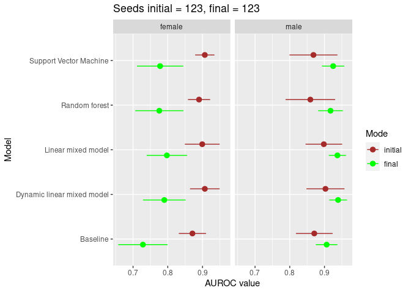
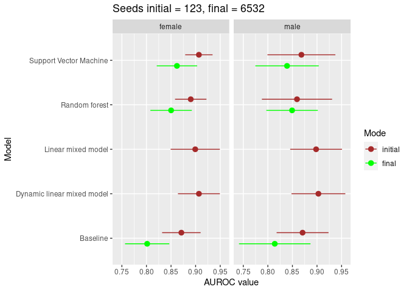

AUROC values in initial and final mode
================
Jarkko Toivonen
2022-04-01

Are results reliable when there so big changes between different runs?
At least if the seed is fixed then the results stay the same. Here I
compare the results from “initial” and “final” modes.

``` r
# Some seed parameters and the AUROC values they gave
seeds <- tibble::tribble(
            ~Seed, ~Male, ~Female,
             574L, 0.872,   0.782,
            1284L, 0.858,   0.811,
            6532L, 0.814,   0.801,
           12397L, 0.848,   0.786
           )
```

``` r
old_filename <- "/home/toivoja/FRCBS/Hb_predictor_container/results/jarkko-2022-02-09-all-10k/summary.csv"    # seed 123
new_filename <- "/home/toivoja/FRCBS/Hb_predictor_container/results/jarkko-2022-03-31-all-final/summary.csv"  # seed 123
new2_filename <- "/home/toivoja/FRCBS/Hb_predictor_container/results/jarkko-2022-03-31-all-final2/summary.csv"  # seed 6532
old <- read_csv(old_filename)
```

    ## Rows: 10 Columns: 17
    ## ── Column specification ────────────────────────────────────────────────────────
    ## Delimiter: ","
    ## chr  (4): Id, Model, Pretty, Sex
    ## dbl (13): MAE (g / L), RMSE (g / L), MAE (mmol / L), RMSE (mmol / L), AUROC ...
    ## 
    ## ℹ Use `spec()` to retrieve the full column specification for this data.
    ## ℹ Specify the column types or set `show_col_types = FALSE` to quiet this message.

``` r
new <- read_csv(new_filename)
```

    ## Rows: 10 Columns: 17
    ## ── Column specification ────────────────────────────────────────────────────────
    ## Delimiter: ","
    ## chr  (4): Id, Model, Pretty, Sex
    ## dbl (13): MAE (g / L), RMSE (g / L), MAE (mmol / L), RMSE (mmol / L), AUROC ...
    ## 
    ## ℹ Use `spec()` to retrieve the full column specification for this data.
    ## ℹ Specify the column types or set `show_col_types = FALSE` to quiet this message.

``` r
new2 <- read_csv(new2_filename)
```

    ## Rows: 6 Columns: 17
    ## ── Column specification ────────────────────────────────────────────────────────
    ## Delimiter: ","
    ## chr (4): Id, Model, Pretty, Sex
    ## dbl (9): AUROC value, AUROC low, AUROC high, AUPR value, AUPR low, AUPR high...
    ## lgl (4): MAE (g / L), RMSE (g / L), MAE (mmol / L), RMSE (mmol / L)
    ## 
    ## ℹ Use `spec()` to retrieve the full column specification for this data.
    ## ℹ Specify the column types or set `show_col_types = FALSE` to quiet this message.

``` r
myplot <- function(old, new) {
  df <- bind_rows(initial=old, final=new, .id="id")
  df %>% ggplot(aes(x=`AUROC value`, xmin=`AUROC low`,  xmax=`AUROC high`, y=Pretty, color=id)) +
    geom_pointrange(position = position_dodge(0.5), key_glyph=ggstance::draw_key_pointrangeh) + 
    facet_grid(~Sex) + 
    scale_color_manual(values=c("brown", "green"), breaks=c("initial", "final")) +
    labs(y="Model", color="Mode")
}
```

``` r
myplot(old, new) + labs(title="Seeds initial = 123, final = 123")
```

<!-- -->

Try with another seed.

``` r
# To save time, I didn't compute the linear models for this seed.
myplot(old, new2) + labs(title="Seeds initial = 123, final = 6532")
```

<!-- -->
